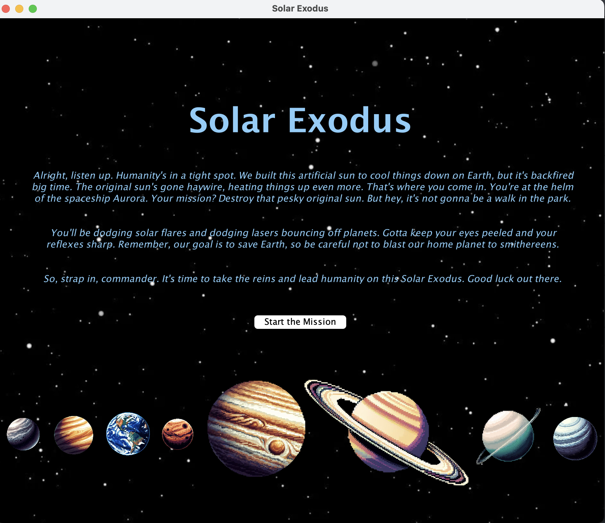
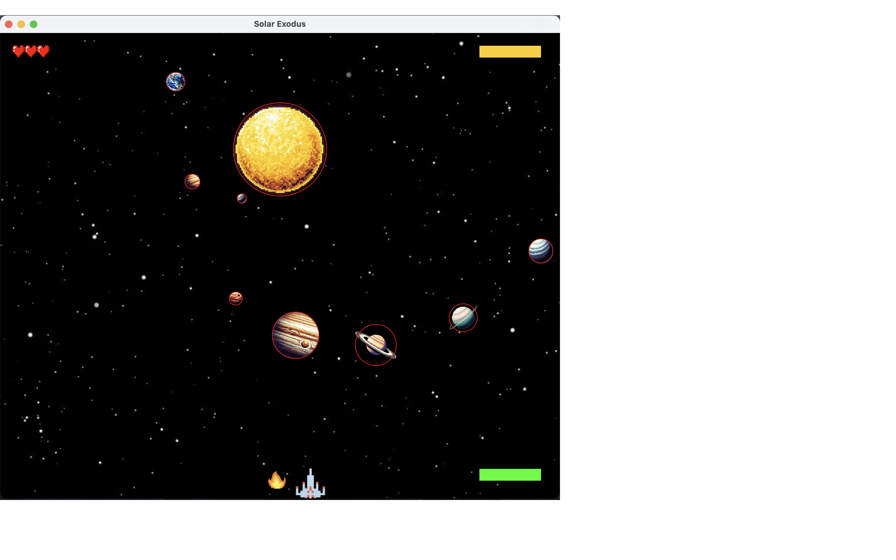

# Solar Exodus

Developers: Batsambuu Batbold, Yeshe Jangchup, and Nadezhda Dominguez Salinas

## Description:
Defend the solar system from the original Sun that has gone haywire by shooting it down using spaceship Aurora, in this arcade-style game.  

## Technical Guide:
### Requirements
  - Java 17 (required for Kilt Graphics)
  - Macalester Kilt Graphics (edu.macalester.graphics)
  - Visual Studio Code

### How to Run the Program
  1. Open the code on an IDE
  2. Go to the GameMain.java file
  3. Click 'run' to start the mission!

### How to Play the Game

  1. Keep your ears open for the amazing storyline and start the mission!
  2. Control the spaceship along the bottom of the screen with your mousepad or left/right arrow keys
  3. To shoot the lasers press the spacebar or click your mousepad/mouse
  4. Avoid the sun flares and hitting the earth! Also watch out for lasers reflecting off the planets. These can cost you a life!
  5. Shoot the sun down until it disappears! And you complete the mission!
  
### Acknowledgements
  We would like to thank the following resources for help and inspiration.
  Help From Preceptors: Courtney, Soulai, 
  Inspiration from the classic arcade-style Space Invaders Game. An example of our inspiration, ("https://freeinvaders.org").
  Sound effects gathered from the following website, (" ").
  Planet images compiled from (" ").
  
### Limitations
The fundamental design limitations may include, no-pause feature after a life is lost, too many lasers on the canvas at the one time can
lead to lagging in the game-play processing. This is a result from a dense and complicated canvas.animate method which consists of multiple if statements and loops.
Possible lagging may occur during game-play every few seconds or so.

### Societal Impact
Our project aims to be inclusive, diversity, accesible to the majority of populations. 
The game includes the following limitations in accesibility:
  - A blind person would not be able to control the spaceship or complete the missoin due to the lack of visual aspects to play the game. 
  - Players of younger age or those who lack hand-eye coordination may find it more difficult to play and complete the mission
  - A person who uses an assistive device or has physical disabilities may also find it quite difficult to play the game.

 An unintended consequence of our software is that it may promote aggressive gameplay and behaviors. 
 We do not foresee our program being used in an oppressive situation but they may exist:
 One possible situation of the program being used in a malicious way, is it could be recreated and used to scam people out of money if the game were monitized.
